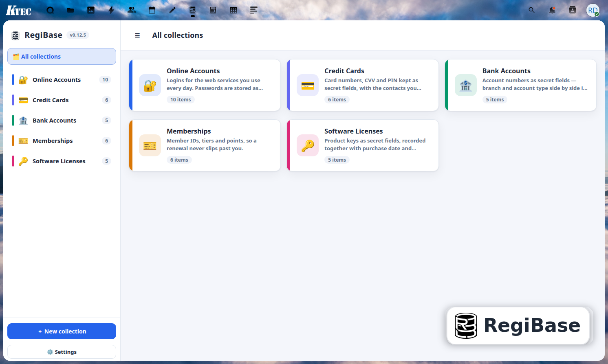
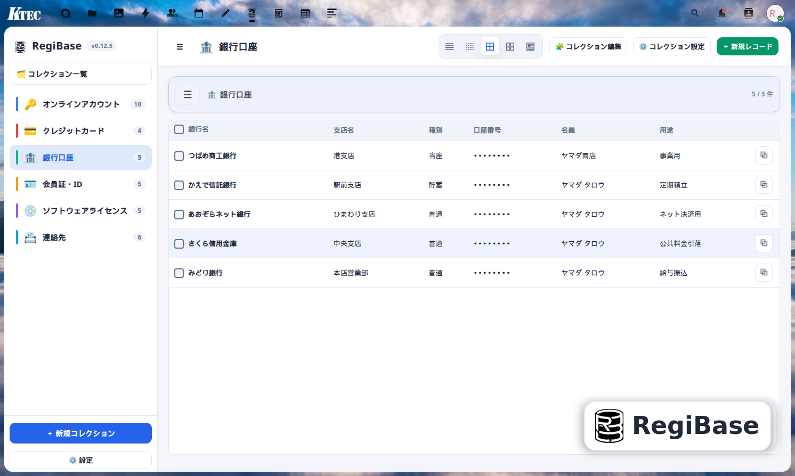
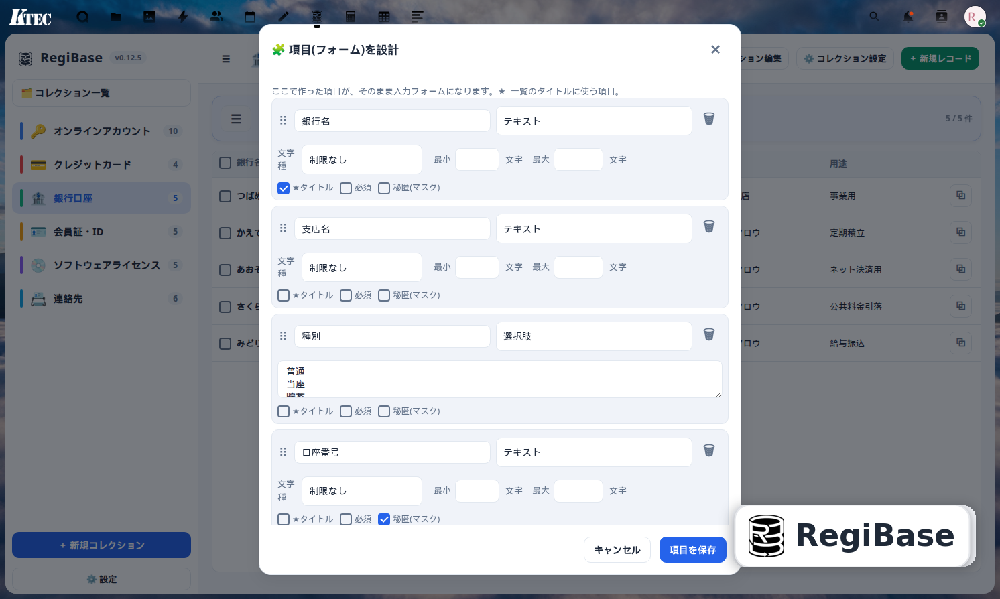
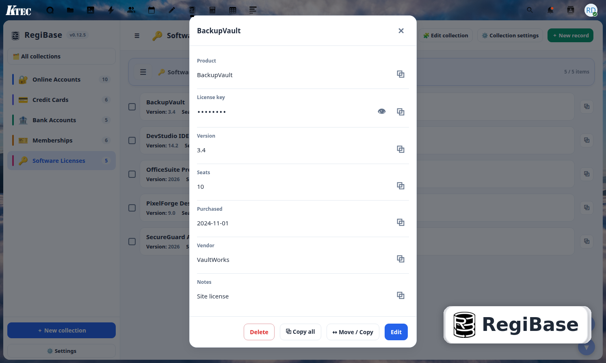
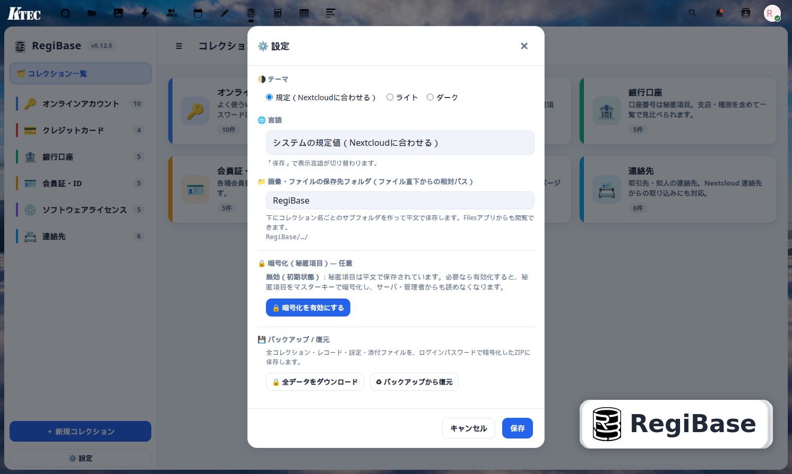
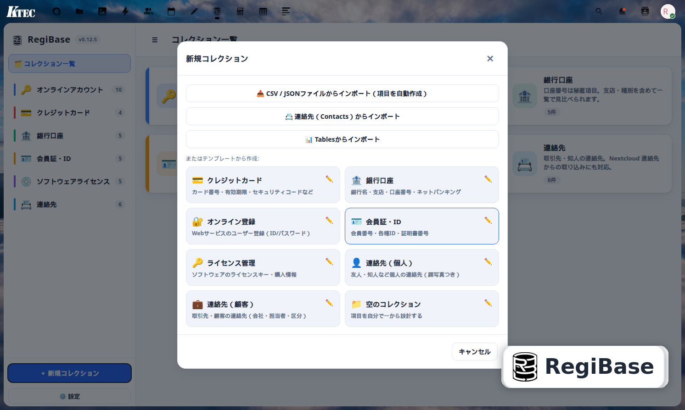
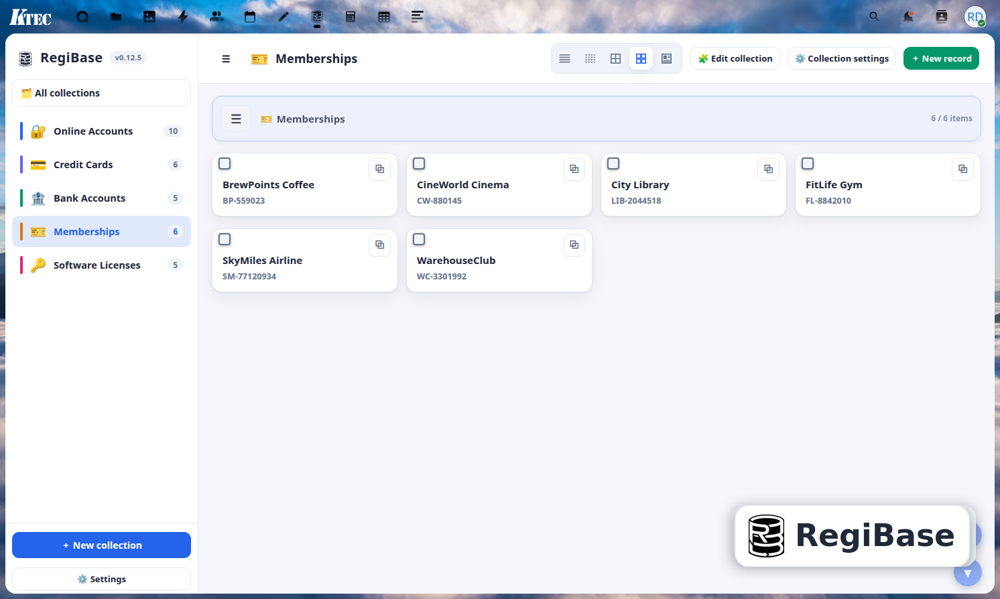
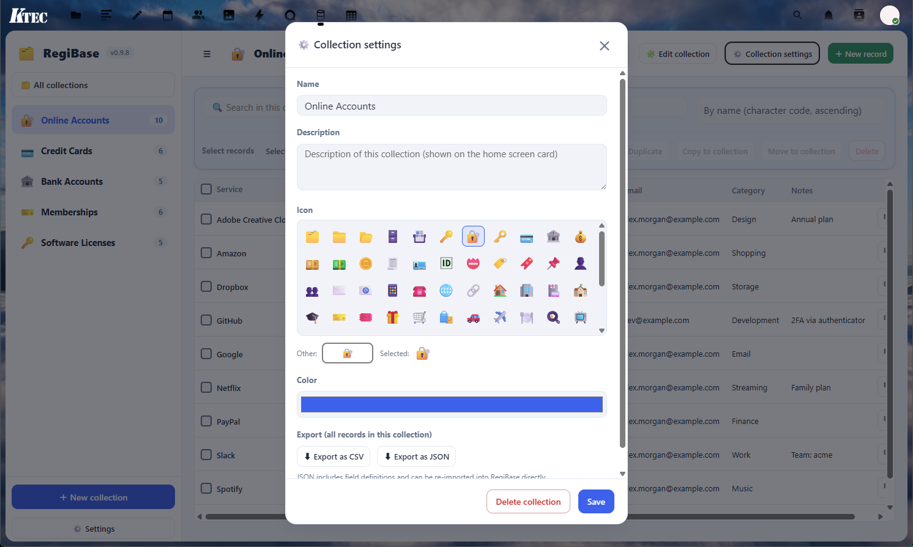

# RegiBase 🗄️

A small personal-database app for Nextcloud. It keeps everyday information in
collections whose fields you set up yourself.
Nextcloud 用の小さなパーソナルデータベースです。日々の情報を、自分で決めた項目の
コレクションにまとめておけます。

> A personal project, written for my own use and shared in case it is useful to someone.
> Self-hosted; your data stays in your own Nextcloud.
> 自分用に作った個人プロジェクトで、どなたかの役に立てばと思い公開しています。
> セルフホストで、データはあなた自身の Nextcloud の中だけに保存されます。

[English ↓](#english) · [日本語 ↓](#japanese)

---

<a id="english"></a>

## English

A Nextcloud app for keeping everyday information — credit cards, bank accounts,
online accounts, memberships, licenses, contacts and so on — in collections whose
fields you set up yourself.

### Features

- **Form templates** — start from a template (credit card, bank account, online
  account, membership, license, contact, …) or design fields from scratch.
  **Save your own templates**, and **edit the built-in ones** (a per-user override
  you can reset to the shipped default).
- **Per-field input rules** — character set, min/max length, patterns.
- **Multiple views** — list, detailed list, **spreadsheet-style table** (with a
  frozen first column and grab-to-scroll), cards, and thumbnail cards.
- **Client-side encryption (optional)** — secret fields (passwords, PINs, card
  numbers…) are encrypted in the browser with **AES-GCM**. The server never sees
  your master key or the plaintext. *Forgetting the master key means the data
  cannot be recovered.*
- **Password-protected backup & restore** — download all data (collections,
  records, settings, attachments) as an **AES-256 encrypted ZIP**, and restore it
  later (overwrite / merge / add).
- **Import** — from **CSV / JSON** (e.g. a Google Password Manager export) or from
  your **Nextcloud Contacts** (including photos). One-way; Contacts is never modified.
- **Attachments** — attach images and files from **Nextcloud Files** or **Notes**. Each collection
  has its own save folder, **created automatically** under a **base folder** (default `RegiBase`,
  configurable in **Settings**) as *base folder / collection name*. When you rename the collection,
  RegiBase offers to rename that folder to match (your files stay put). When you delete a collection
  you can optionally move its save folder to the trash.
- **Organise** — move, copy or merge records between collections.
- **Duplicate a collection** — copy just the fields, or the whole thing **including
  its records**.
- **Collection sharing** — share with other Nextcloud users at three levels
  (**view / edit / delete**), with an optional access password and optional
  secret-field sharing.
- **Nextcloud Tables integration** — **import** a Tables table into a new collection,
  or **export** a collection to a new Tables table.
- **20 languages** — 日本語 · English · 简体中文 · Español · Français · Deutsch ·
  Русский · Português · العربية · हिन्दी · 한국어 · Italiano · Čeština · فارسی ·
  Bahasa Indonesia · Polski · ไทย · Türkçe · Українська · Tiếng Việt. Pick a language
  in the app independently of your Nextcloud language.

### Works with your other Nextcloud apps

RegiBase can use a few other Nextcloud apps when they happen to be installed:

- **Contacts** — import contacts, photos included, into a collection.
- **Tables** — import a table into a new collection, or export a collection to Tables.
- **Files** — attach any document, or pick images, straight from your Files.
- **Notes** — attach a note to a record.
- **Calendar** — add a reminder from a date field; it opens Calendar's new-event editor prefilled with the date.

An **Address** field type adds a 🌐 button that opens the value in Google Maps,
OpenStreetMap or Apple Maps (chosen in Settings).

Each action is available only when the relevant app is enabled; otherwise the
button stays disabled.

### Requirements

- Nextcloud **30 – 33**
- PHP 8.1+
- A Nextcloud-supported database (MySQL/MariaDB, PostgreSQL or SQLite)

### Installation

RegiBase is on the **Nextcloud App Store** — search for **RegiBase** under
Apps → Organization or Tools ([apps.nextcloud.com/apps/regibase](https://apps.nextcloud.com/apps/regibase)).

Or install manually from source:

```bash
cd /path/to/nextcloud/apps
git clone https://github.com/ktec-nc-apps/RegiBase.git regibase
sudo -u www-data php ../occ app:enable regibase
```

Then open **RegiBase** from the Nextcloud app menu.

### Command line (occ)

RegiBase can be driven from the server console — useful for scripts and backups:

```bash
occ regibase:collections [--user=UID]              # list collections
occ regibase:records <collection> [--user=UID]     # list a collection's records
occ regibase:get <collection> <record> [--field=KEY] [-o json]
occ regibase:export <collection> [--format=json|csv]
occ regibase:find <collection> <query> [--regex]   # search by field value
occ regibase:master <status|set|change|remove> --user=UID   # manage the master key
```

`<collection>` is an id or a name. Everything except `regibase:master` is **read-only**. Secret fields
are masked unless you pass `--reveal`, in which case the master password is read
from the `REGIBASE_PASSWORD` environment variable or an interactive hidden prompt
(the server-side decrypt mirrors the browser's PBKDF2 / AES-GCM and verifies the
password first). Example — fetch one secret value for a script:

```bash
REGIBASE_PASSWORD='…' occ regibase:get Passwords 3708 --reveal --field=Token
```

---

<a id="japanese"></a>

## 日本語

クレジットカード・銀行口座・オンラインアカウント・会員情報・ライセンス・連絡先など、
日々の情報を、自分で決めた項目のコレクションとして整理・保管しておける Nextcloud
アプリです。

### 特長

- **フォームテンプレート** — クレジットカード / 銀行口座 / オンラインアカウント /
  会員 / ライセンス / 連絡先… などのテンプレートから始めても、ゼロから項目を設計しても OK。
  **自分のテンプレートを保存**したり、**初期テンプレートを編集**（自分用に上書き・既定に戻す）もできます。
- **項目ごとの入力規則** — 文字種・最小/最大長・パターン（正規表現）を指定できます。
- **複数の表示形式** — リスト / リスト詳細 / **表計算風テーブル**（先頭列を固定して
  掴んで横スクロール）/ カード / サムネイル付きカード。
- **クライアント側暗号化（任意）** — パスワードや暗証番号、カード番号などの秘密項目は、
  ブラウザ内で **AES-GCM** により暗号化されます。サーバーはマスターキーも平文も一切見ません。
  *マスターキーを忘れるとデータは復元できません。*
- **パスワード付きバックアップ／復元** — 全データ（コレクション・レコード・設定・添付）を
  **AES-256 暗号化 ZIP** でダウンロードし、あとから復元（上書き／マージ／追加）できます。
- **インポート** — **CSV / JSON**（例：Google パスワードマネージャーのエクスポート）や、
  **Nextcloud 連絡先**（写真含む）から取り込めます。一方向で、連絡先側は変更しません。
- **添付** — **Nextcloud Files** や **Notes** から画像・ファイルを添付できます。コレクションごとに
  保存先フォルダを持ち、そのフォルダは**基準フォルダ**（既定 `RegiBase`、**設定**で変更可能）の下に
  「基準フォルダ／コレクション名」で**自動作成**されます。タイトルを変更するとフォルダ名も合わせて変更するか
  確認します（データはそのまま残ります）。コレクションを削除する際は、保存先フォルダをゴミ箱へ移動することもできます。
- **整理** — レコードをコレクション間で移動・コピー・マージできます。
- **コレクションの複製** — 項目だけ、または**レコードごと**丸ごと複製できます。
- **コレクション共有** — 他の Nextcloud ユーザーと **閲覧 / 編集 / 削除** の3段階で共有。
  任意のアクセスパスワードや、秘密項目の共有にも対応します。
- **Nextcloud Tables 連携** — Tables のテーブルを新規コレクションとして**取り込み**、
  またはコレクションを Tables へ**書き出し**できます。
- **20 言語対応** — 日本語 · English · 简体中文 · Español · Français · Deutsch ·
  Русский · Português · العربية · हिन्दी · 한국어 · Italiano · Čeština · فارسی ·
  Bahasa Indonesia · Polski · ไทย · Türkçe · Українська · Tiếng Việt。
  Nextcloud 本体の言語とは独立に、アプリ内で言語を選べます。

### 他の Nextcloud アプリと連携

RegiBase は、以下のアプリが入っていれば、それらを利用します:

- **Contacts（連絡先）** — 連絡先（写真含む）をコレクションに取り込み。
- **Tables** — テーブルを新規コレクションとして取込、またはコレクションを Tables へ書出。
- **Files（ファイル）** — 任意のファイルの添付や、画像の選択を Files から直接。
- **Notes（メモ）** — レコードにメモを添付。
- **Calendar（カレンダー）** — 日付項目からリマインダーを追加。日付を入れた新規イベント画面が開きます。

項目タイプ「住所」を使うと、その値に 🌐 ボタンが付き、Google マップ／OpenStreetMap／Apple マップ
（設定で選択）で開けます。

各操作は、対応するアプリが有効なときにのみ使えます（無効時はボタンはグレーアウトします）。

### 動作環境

- Nextcloud **30 – 33**
- PHP 8.1 以上
- Nextcloud 対応データベース（MySQL/MariaDB, PostgreSQL, SQLite）

### インストール

**Nextcloud App Store** で公開しています。管理者の「アプリ」→「整理」または「ツール」で
**RegiBase** を検索してインストールできます（[apps.nextcloud.com/apps/regibase](https://apps.nextcloud.com/apps/regibase)）。

または、ソースから手動で導入する場合:

```bash
cd /path/to/nextcloud/apps
git clone https://github.com/ktec-nc-apps/RegiBase.git regibase
sudo -u www-data php ../occ app:enable regibase
```

その後、Nextcloud のアプリメニューから **RegiBase** を開きます。

### コマンドライン（occ）

RegiBase はサーバーのコンソールから操作できます。スクリプトやバックアップに便利です:

```bash
occ regibase:collections [--user=UID]              # コレクション一覧
occ regibase:records <collection> [--user=UID]     # コレクションのレコード一覧
occ regibase:get <collection> <record> [--field=KEY] [-o json]
occ regibase:export <collection> [--format=json|csv]
occ regibase:find <collection> <query> [--regex]   # 値で検索（正規表現も可）
occ regibase:master <status|set|change|remove> --user=UID   # マスターキー管理
```

`<collection>` は id か名前で指定します。`regibase:master` 以外は**読み取り専用**です。秘密フィールドは
既定でマスクされ、`--reveal` を付けたときだけ復号します。その際のマスターパスワードは
環境変数 `REGIBASE_PASSWORD` または対話式の隠し入力から読み取ります（サーバー側の復号は
ブラウザと同じ PBKDF2 / AES-GCM を再現し、事前にパスワードを検証します）。例 —
スクリプトから秘密の値を 1 つ取り出す:

```bash
REGIBASE_PASSWORD='…' occ regibase:get Passwords 3708 --reveal --field=Token
```

---

## Screenshots

| | |
|---|---|
|  |  |
| Collections home / コレクション一覧 | Table view / テーブル表示 |
|  |  |
| Design fields / 項目設計 | Record detail / レコード詳細 |
|  |  |
| Settings / 設定 | Templates / テンプレート |
|  |  |
| Card view / カード表示 | Collection settings / コレクション設定 |

## Architecture

The frontend is a single **Vue 3** application. The source
(`js/regibase.js`) is authored as a template and **pre-compiled** into an
eval-free production build (`js/regibase.dist.js`) that ships with the
**runtime-only** Vue build — so RegiBase runs **without `unsafe-eval`** in its
Content-Security-Policy. The backend is a standard Nextcloud app (controllers,
QBMapper entities, services).

フロントエンドは単一の **Vue 3** アプリです。ソース（`js/regibase.js`）はテンプレートとして
記述し、**事前コンパイル**して eval 不要の本番ビルド（`js/regibase.dist.js`）を生成、
**ランタイム専用** Vue と組み合わせて配布します。これにより CSP で `unsafe-eval` を
**使わずに**動作します。バックエンドは標準的な Nextcloud アプリ構成です。

## Third-party

- [Vue.js](https://vuejs.org/) 3 (MIT).

## License

[GNU AGPL v3](LICENSE) · © KTEC
